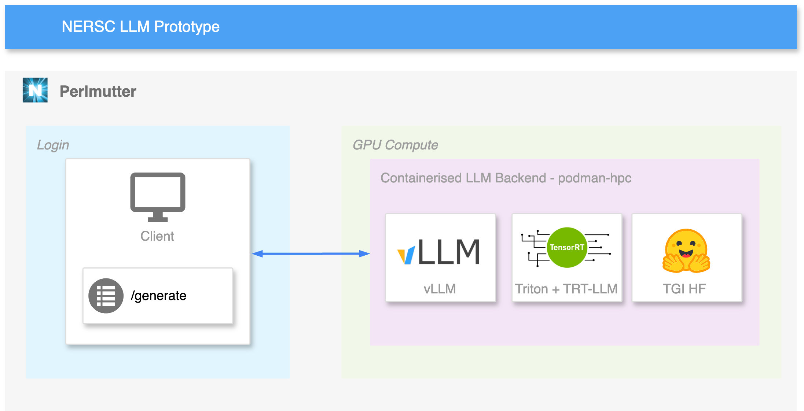

# NERSC LLM Prototype

This repo is how to deploy an LLM backend on Perlmutter.



## Setup


## Run

### Deploy backend

To deploy one of the supported backend you can use this in a slurm job:
```bash
module load python/3.11
python -m nersc_llm [backend-type] <cli-args>
```

| Backend | backend-name |
|---|---|
| [vLLM](https://docs.vllm.ai/en/latest/) | `vllm` |
| [Triton + TensorRT-LLM](https://github.com/triton-inference-server/tensorrtllm_backend) | `tritontrt` |
| [HF Text Generation Inference](https://huggingface.co/docs/text-generation-inference/en/index) | `tgi` |


### Client

#### curl

#### python requests


--- 

# Notes 

- WIP