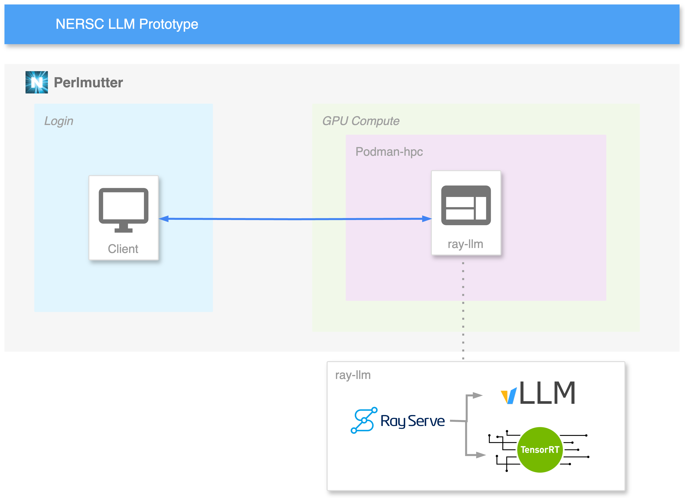

# NERSC LLM Prototype

This prototype uses https://github.com/ray-project/ray-llm/tree/master.




> [!WARNING]  
> Currently this isn't working due to `ray-llm` issues

## Setup

```bash
podman-hpc pull docker.io/anyscale/ray-llm:0.5.0
```

## Run

### Deploy `ray-llm`

Start slurm job:
```bash
salloc -N 1 -C gpu -G 4 --gpu-bind=closest -t 01:00:00 -q interactive -A <account>
```

<sup>*</sup>Customisations:

```bash
export HF_HOME=$SCRATCH/huggingface/
export HF_TOKEN=$(cat $HOME/.hf_token)
```

Start container:
```bash
podman-hpc run -it --rm \
    --user 0 \
    --name ray_llm \
    --gpu --network host \
    --shm-size=20g --ulimit memlock=-1 \
    -v ${HF_HOME:-${HOME}/.cache/huggingface}:/home/ray/.cache/huggingface \
    -e "HF_TOKEN=$HF_TOKEN" \
    docker.io/anyscale/ray-llm:0.5.0
```

In the container:
```bash
serve run /home/ray/serve_configs/meta-llama--Llama-2-7b-chat-hf.yaml
```

Run to increase logging:
```bash
export RAY_BACKEND_LOG_LEVEL=debug
```

### Client

Can be run anywhere:
```bash
export ENDPOINT_URL="http://localhost:8000/v1"
```


#### curl

```bash
curl $ENDPOINT_URL/chat/completions \
  -H "Content-Type: application/json" \
  -d '{
    "model": "meta-llama/Llama-2-7b-chat-hf",
    "messages": [{"role": "system", "content": "You are a helpful assistant."}, {"role": "user", "content": "Hello!"}],
    "temperature": 0.7
  }'
```

#### python requests

```bash
module load python
python requests.py
```


--- 

# Notes 

- Trouble running as non-root due to file permissions. Couldn't read huggingface cache folder.
- Issues with `ray-llm` building the app.